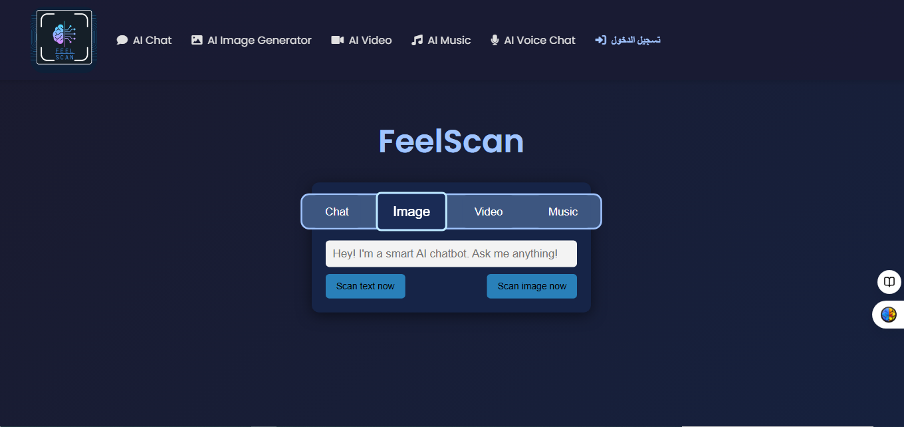

# FeelScan: An Advanced Sentiment and Emotion Analysis System

## Project Overview

**FeelScan** is a comprehensive web application built with the Python Flask framework, designed to provide advanced solutions for **Sentiment Analysis** from text and **Emotion Detection** from images. The project leverages state-of-the-art Artificial Intelligence and Deep Learning models to deliver accurate and reliable results, making it a valuable tool for data analysis, market research, and user interaction studies.

## Key Features

The FeelScan system offers the following core functionalities:

1.  **Arabic Text Sentiment Analysis**: Utilizes a specialized BERT model fine-tuned for the Arabic language to classify text sentiment into specific categories, including Sadness, Anger, Happiness, Surprise, Fear, and Neutral.
2.  **English Text Sentiment Analysis**: Provides support for analyzing sentiment in English text using the TextBlob library.
3.  **Image Emotion Detection**: Employs the FER (Face Emotion Recognition) library to analyze facial images and determine the dominant emotion (for example, Angry, Happy, Sad).
4.  **Simple and Effective User Interface**: Allows users to directly input text or upload image files to receive instant analysis results.

## Technology Stack

The project is built upon a robust set of open-source technologies and libraries:

| Category | Technologies and Libraries | Description |
| :--- | :--- | :--- |
| **Backend** | Python, Flask | The core programming language and framework for running the application and serving the frontend. |
| **Sentiment Analysis** | Hugging Face Transformers (Arabic BERT Model), TextBlob | Advanced Deep Learning models for analyzing sentiment in both Arabic and English texts. |
| **Emotion Detection** | OpenCV, FER (Face Emotion Recognition) | Used for image processing, face detection, and emotion analysis. |
| **Frontend** | HTML5, CSS3, JavaScript (AJAX) | For designing the interactive user interface and displaying the results. |

## Prerequisites

To ensure the project runs correctly, the following prerequisites must be met:

*   **Python 3.x**
*   **pip** (Python package manager)

## Installation and Setup Guide

Follow these steps to get the project running on your local machine:

### 1. Clone the Repository

```bash
git clone https://github.com/Eng-Akil-Alsufi/FeelScan
cd FeelScan
```

### 2. Create a Virtual Environment (Recommended)

```bash
python3 -m venv venv
source venv/bin/activate  # For Linux/macOS
# venv\Scripts\activate   # For Windows
```

### 3. Install Dependencies

The project requires several scientific and programming libraries.

```bash
pip install Flask transformers textblob opencv-python numpy moviepy fer
```

### 4. Run the Application

After installing all requirements, you can start the Flask server:

```bash
python app.py
```

The application will be accessible at: `http://127.0.0.1:5000/`

## Project Structure

| Path | Description |
| :--- | :--- |
| `app.py` | The main application file containing the Flask server logic and routes for text and image analysis. |
| `templates/` | Contains the HTML template files (`index.html`, `about.html`). |
| `static/` | Contains static files such as stylesheets (`css/styles.css`) and images (`images/logo.jpg`). |
| `uploads/` | A folder used to temporarily store user-uploaded files for processing. |
| `F1.png`, `F2.png` | Screenshots of the application's user interfaces. |

## Application Screenshots

The following images illustrate the main user interface of the application:

### Main Interface (Text and Image Analysis)


### Secondary Interface



## Author

This project was developed by **Eng. Akil Alsufi**.

*   **GitHub Profile**: [Eng-Akil-Alsufi](https://github.com/Eng-Akil-Alsufi)
*   **Email**: akilasofy3@gmail.com

---
